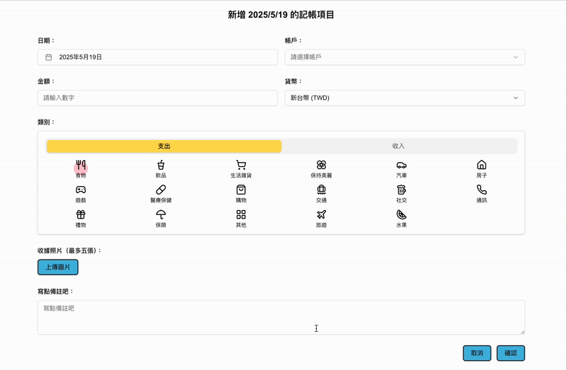
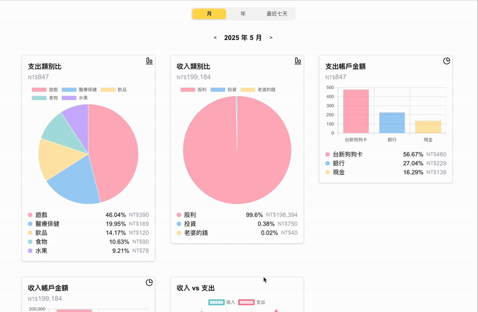
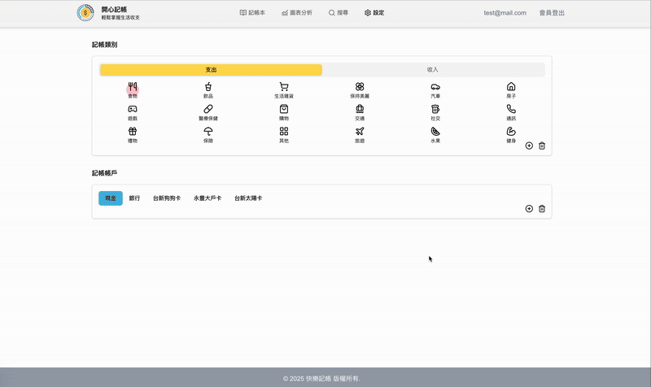

#  [開心記帳 Coin Tracker](https://coin-tracker-eosin.vercel.app/)

---

## 網站簡介

「開心記帳」是一款簡潔高效的記帳工具，支援收入/支出分類、圖表分析、自訂分類、帳戶與圖片上傳，適合日常收支管理。

## 專案亮點

- **多幣別支援與匯率自動轉換**：
  - 支援記錄多種外幣交易，並根據 exchangerate.host 每月匯率自動轉換為新台幣，提供準確報表。
- **智能化圖表與分析報表**：
  - 圓餅圖、折線圖、直條圖等，協助清晰掌握收支趨勢與花費結構。
- **自訂帳戶管理**：
  - 可新增多個帳戶（如現金、信用卡、銀行帳戶等），分別記錄與統計收支。
- **靈活的類別設定**：
  - 可自訂收入與支出分類，搭配 Icon 與軟刪除設計，確保使用彈性。
- **圖片上傳與預覽**：
  - 可為每筆記錄上傳發票或單據圖片，支援預覽與放大。
- **快速搜尋與關鍵字高亮**：
  - 支援模糊搜尋備註，並高亮顯示關鍵字，找資料更快速。

## 使用技術

| 類別        | 技術                                                                    |
|-----------|-----------------------------------------------------------------------|
| 前端框架      | [Next.js 15](https://nextjs.org/)  (React 19)                         |
| 語言        | TypeScript                                                            |
| 狀態管理      | Zustand                                                               |
| 表單驗證      | React Hook Form、Zod                                                   |
| UI 樣式     | Tailwind CSS、[shadcn/ui](https://ui.shadcn.com/)（基於 Radix + Tailwind） |
| 圖表        | Chart.js、react-chartjs-2                                              |
| 前端認證      | Firebase Authentication（使用者登入、token 建立）                   |
| 後端驗證與 API | Firebase Admin SDK + Next.js App Router API（token 驗證與存取控制） |                                            |
| 資料庫       | Firebase Firestore、Firebase Storage                                   |
| 圖片預覽      | react-photo-view、react-images-uploading                               |
| 日期處理      | date-fns、react-day-picker                                             |
| 開發工具      | ESLint、Prettier、Husky、lint-staged                                     |
| 部署        | Vercel                                                                |

## 網站 Demo
#### RWD：針對電腦、平板、手機的響應式設計

#### 註冊及登入
使用者可以使用信箱註冊及登入，支援表單驗證。另可使用測試帳號或 Google 帳號快速登入。

#### 記帳本
支援 CRUD 功能，可紀錄不同幣值（即時轉換每月匯率）及圖片上傳與預覽。

#### 圖表分析
可以依照類別、帳戶的收入/支出顯示圓餅圖及直條圖，有助於使用者快速掌握財務概況。

#### 搜尋關鍵字
模糊搜尋備註關鍵字，即時高亮顯示，表格無限滾動，每次加載 100 筆資料。

#### 設定類別及帳戶
自訂 Icon 類別及設定不同帳戶，增加記帳使用彈性，輔以清晰直覺的呈現方式，有助於提升記帳的完整性與靈活性。

